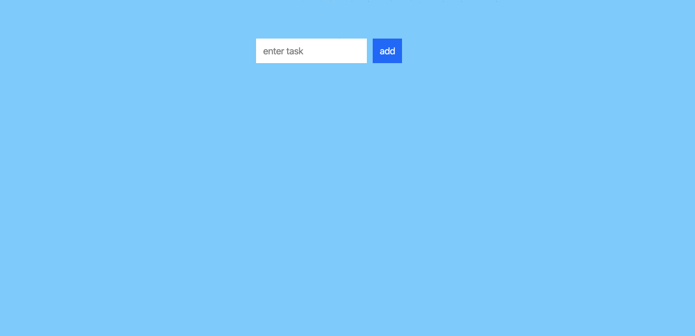

# TodoList Test

This repo contains a skeleton for a simple todo list along with corresponding tests that should pass when the app is completed. The goal of this test is to complete the app and make the tests pass.

The completed app looks like the animated gif below. When you type in text for a new task, pressing enter or clicking on the add button adds that new task to the list and clears out the input field. If you click on an individual task, it removes the task from the list. A task may not be entered with empty text.



## Setup

A recent nodejs is required.

First fork this repo into your own github account. Once you've made a fork of the repo, clone the fork to your local machine.

When you are done with the coding challenge, go ahead and push it back up to github and submit a PR. You can do multiple pushes if you'd like. The goal is to complete this in under 1 hour, but if you need more time that is fine as we will review it tomorrow.

```

# install the dependencies
npm install

# start the app
npm start

# run the tests
npm test
```
